# **Penerapan Sentence-BERT untuk Klasterisasi Ulasan Aplikasi TradingView: Studi NLP dengan Unsupervised Learning**

Lukmanul Hakim  
*Fakultas Ilmu Komputer*  
*Universitas Dian Nuswantoro*

1. # **Pendahuluan**

	Analisis opini pengguna merupakan bagian penting dalam pengembangan produk digital. Namun, ulasan yang tersedia di aplikasi seperti TradingView umumnya tidak terstruktur. Oleh karena itu, pendekatan Natural Language Processing (NLP) dan unsupervised learning diperlukan untuk mengelompokkan ulasan berdasarkan kesamaan makna. Tujuan dari proyek ini adalah untuk mengelompokkan ulasan pengguna aplikasi TradingView menggunakan Sentence-BERT dan metode klastering seperti KMeans dan HDBSCAN, serta mengevaluasi dan memvisualisasikan hasilnya.

2. # **Landasar Teori**
   1. **Natural Language Processing dan Analisis Teks Ulasan**

	Natural Language Processing (NLP) adalah salah satu bidang dalam kecerdasan buatan yang berfokus pada bagaimana komputer dapat memahami dan berinteraksi dengan bahasa manusia. Dalam konteks ulasan pengguna, NLP dimanfaatkan untuk mengolah teks yang awalnya tidak terstruktur agar bisa dianalisis secara sistematis. Proses ini melibatkan beberapa tahapan, seperti membersihkan teks, melakukan normalisasi, hingga mengekstraksi makna dari kata-kata atau kalimat yang digunakan. Dengan pendekatan ini, kita bisa menggali wawasan dari ribuan opini pengguna tanpa harus melakukan pelabelan atau pengkodean manual. Karena itulah, NLP menjadi teknologi kunci dalam berbagai sistem analitik modern, terutama untuk mengolah data berbasis teks seperti review aplikasi, komentar di media sosial, atau jawaban terbuka dalam survei.

	Klastering adalah metode *unsupervised learning* yang digunakan untuk mengelompokkan data ke dalam beberapa grup berdasarkan kemiripan tertentu. Dalam analisis teks, teknik ini sangat berguna untuk menemukan pola atau topik umum tanpa label. Algoritma **KMeans** bekerja dengan menentukan jumlah klaster di awal, lalu mengelompokkan data berdasarkan kedekatan terhadap pusat klaster (centroid). Meskipun KMeans cukup populer, algoritma ini memiliki keterbatasan saat menghadapi data berdimensi tinggi atau mengandung noise. Sebagai alternatif, **HDBSCAN** (Hierarchical Density-Based Spatial Clustering of Applications with Noise) digunakan karena mampu mengidentifikasi klaster berdasarkan kepadatan data, tanpa harus menentukan jumlah klaster terlebih dahulu. HDBSCAN juga dapat mengenali data yang tidak termasuk ke dalam klaster mana pun, menjadikannya cocok untuk data teks yang cenderung tidak terstruktur dan mengandung banyak variasi. 

	2. **Sentence Embedding dengan Sentence-BERT**

	Representasi teks merupakan aspek krusial dalam analisis berbasis NLP. Salah satu pendekatan modern yang banyak digunakan adalah **Sentence-BERT (SBERT)**, yaitu pengembangan dari model BERT (Bidirectional Encoder Representations from Transformers) yang dirancang khusus untuk menghasilkan embedding kalimat. Berbeda dari metode tradisional seperti Bag-of-Words atau TF-IDF yang hanya memperhitungkan frekuensi kata tanpa memperhatikan konteks, SBERT mampu menangkap makna semantik dari sebuah kalimat secara menyeluruh.

	Model ini bekerja dengan menghasilkan vektor berdimensi tetap untuk setiap kalimat, yang dapat digunakan dalam berbagai tugas seperti klastering, pencarian semantik, atau pengukuran kesamaan antar kalimat. Dengan pendekatan ini, kalimat-kalimat yang berbeda secara struktur tetapi memiliki makna yang mirip akan direpresentasikan secara dekat di ruang vektor. Oleh sebab itu, Sentence-BERT menjadi pilihan ideal dalam proyek ini karena mampu mengubah ulasan pengguna yang kompleks menjadi bentuk numerik yang siap dianalisis lebih lanjut.

	3. **Reduksi dimensi dengan PCA (Principal Component Analysis)**

	Data hasil embedding dari model seperti Sentence-BERT biasanya berdimensi tinggi (misalnya 384 atau 768 dimensi), yang dapat menyulitkan proses klastering dan visualisasi. Oleh karena itu, digunakan metode reduksi dimensi seperti **Principal Component Analysis (PCA)** untuk menyederhanakan kompleksitas data dengan tetap mempertahankan informasi utama yang dikandungnya. PCA bekerja dengan mengubah data ke dalam dimensi baru berdasarkan arah variansi terbesar.

3. # **Metodologi**

	Metodologi yang digunakan dalam proyek ini mencakup tahapan-tahapan utama dalam pemrosesan data teks berbasis NLP dan unsupervised learning. Proses ini disusun secara berurutan mulai dari akuisisi data, pembersihan teks, representasi semantik, klastering, hingga evaluasi dan visualisasi hasil.

1. **Pengumpulan Dataset**

	Data yang dianalisis pada ekperimen ini berasal dari hasil scraping ulasan pengguna aplikasi TradingView di PlayStore. Data mentah tersebut kemudian dibersihkan dari nilai kosong (missing values) sebelum masuk ke tahap selanjutnya.

2. **Preprocessing Teks:** 

Agar data teks siap dianalisis, dilakukan serangkaian proses pembersihan meliputi:

- **Normalisasi teks**: Mengubah seluruh huruf menjadi lowercase untuk konsistensi.  
- **Ekspansi kontraksi**: Mengganti bentuk singkatan seperti "can't" menjadi "cannot" menggunakan library *contractions*.  
- **Penghapusan noise**: Menghilangkan elemen tidak relevan seperti tautan URL, emoji, angka, serta tanda baca.  
- **Tokenisasi**: Memecah teks menjadi satuan kata menggunakan fungsi word\_tokenize.  
- **Stopword removal**: Menghapus kata-kata umum (seperti “the”, “is”, dan “and”) yang tidak mengandung makna penting dalam konteks semantik.  
- **Penghapusan kata khusus**: Menghapus kata-kata berulang seperti “app” yang tidak memberikan kontribusi signifikan dalam analisis makna.

Perlu dicatat bahwa proses **stemming dan lemmatization tidak dilakukan**. Hal ini disebabkan karena model representasi yang digunakan, yaitu Sentence-BERT, bekerja secara kontekstual pada bentuk kalimat lengkap. Melakukan stemming justru berpotensi merusak struktur semantik yang ingin ditangkap oleh model tersebut.

3. **Sentence Embedding: Menggunakan model all-MiniLM-L6-v2 dari Sentence-BERT.**

	Setelah teks dibersihkan, setiap ulasan dikonversi menjadi representasi numerik menggunakan model **Sentence-BERT** varian all-mpnet-base-v2, model ini dipilih karena memiliki performa yang unggul dibandingkan dengan model-model sejenisnya. Model ini mengubah kalimat menjadi vektor berdimensi tetap (384 dimensi), di mana posisi vektor dalam ruang menggambarkan makna kalimat tersebut. Pendekatan ini memungkinkan pemahaman semantik yang lebih dalam dibandingkan dengan metode tradisional berbasis frekuensi kata.

4. **Reduksi Dimensi: PCA digunakan untuk menyederhanakan embedding.**

	Hasil embedding dari model Sentence-BERT memiliki dimensi yang cukup tinggi, yaitu 384 dimensi untuk setiap kalimat. Untuk menyederhanakan struktur data dan memudahkan proses klastering serta visualisasi, dilakukan reduksi dimensi menggunakan Principal Component Analysis (PCA) dengan parameter n\_components=2.

	Dengan menurunkan dimensi ke 2 komponen utama, proses ini bertujuan untuk menangkap sebanyak mungkin variansi yang terkandung dalam data awal, sekaligus memungkinkan data divisualisasikan langsung dalam bentuk dua dimensi. Nilai 2 komponen ini dianggap lebih baik dibandingakan dengan jumlah komponen selain 2\. Pendekatan ini dianggap cukup efektif untuk menggambarkan pola distribusi data secara global dan membantu algoritma klastering membentuk kelompok yang bermakna.

5. **Klastering**

	Tahap inti dari analisis ini adalah proses pengelompokan data atau klastering. Dua metode yang digunakan adalah:

1) **KMeans**: Algoritma ini membagi data ke dalam sejumlah klaster yang telah ditentukan sebelumnya. Pemilihan jumlah klaster dilakukan secara eksploratif dengan melihat metrik evaluasi. Kelebihannya adalah kesederhanaan dan kecepatan komputasi.  
   2) **HDBSCAN**: Berbeda dengan KMeans, HDBSCAN tidak memerlukan jumlah klaster di awal dan lebih fleksibel dalam menangani data dengan struktur kompleks atau berisi noise. HDBSCAN dapat mengidentifikasi data yang tidak cocok dengan klaster manapun sebagai outlier.

Penggunaan kedua algoritma ini bertujuan untuk mengeksplorasi struktur topik dalam ulasan pengguna serta membandingkan metode mana yang lebih cocok untuk dataset dengan karakteristik seperti teks ulasan yang umumnya data ini saling tumpang tindih dan butuh algoritma yang dapat memahami konteks yang dibahas didalamnya.

6. **Evaluasi**

	Untuk mengukur kualitas hasil klaster, digunakan dua metrik evaluasi yang umum dalam analisis clustering:

1) Silhouette Score: Mengukur seberapa mirip suatu titik data terhadap klasternya dibandingkan dengan klaster lain. Nilai mendekati 1 menunjukkan pemisahan yang baik.  
2) Davies-Bouldin Index: Menilai tingkat kedekatan antar klaster. Nilai yang lebih kecil menandakan bahwa antar klaster lebih terpisah dan hasil klastering lebih baik.  
     
   7. **Visualisasi: PCA plot, WordCloud per klaster.**

	Untuk memahami struktur klaster yang terbentuk secara visual, hasil reduksi dimensi dari PCA dengan dua komponen utama (n\_components=2) digunakan sebagai dasar visualisasi. Proyeksi dua dimensi ini memungkinkan representasi visual dari distribusi data dan posisi relatif antar klaster.

	Setiap titik pada grafik mewakili satu ulasan pengguna dalam bentuk vektor 2D hasil transformasi PCA. Klaster-klaster yang terbentuk dari KMeans atau HDBSCAN kemudian dipetakan menggunakan pewarnaan berbeda untuk menunjukkan pemisahan antar kelompok.

	Selain itu, visualisasi tambahan berupa **WordCloud** juga digunakan untuk masing-masing klaster. WordCloud ini menampilkan kata-kata paling dominan dalam setiap kelompok, sehingga memudahkan dalam mengidentifikasi tema atau topik yang sering muncul di dalamnya. Gabungan antara plot PCA dan WordCloud memberikan gambaran intuitif tentang isi dan struktur klaster yang dihasilkan dari analisis.

4. # **Hasil dan Analisis**

Eksperimen ini menggunakan dataset ulasan aplikasi TradingView diamana pada dataset ini terdapat 2000 data dan 11 fitur namun eksperimen ini hanya menggunakan *content* yang berisi teks ulasan. Pemilihan satu kolom ini bertujuan untuk memfokuskan analisis pada konten naratif yang merepresentasikan opini atau pengalaman pengguna.

| Total Data | 20000 |
| :---: | :---- |
| **Fitur** | reviewId |
|  | userName |
|  | userImage |
|  | content |
|  | score |
|  | thumbsUpCount |
|  | reviewCreatedVersion |
|  | at |
|  | replyContent |
|  | repliedAt |
|  | appVersion |

Tabel 4\. 1 Dataset

Selanjutnya dataset ini melalui tahapan preprosesing untuk memastikan setiap ulasan dalam format yang bersih dan konsisten sehingga siap untuk digunakan.

Langkah-langkah preprocessing yang dilakukan antara lain:

1) Lowercasing yaitu tahap dimana seluruh teks diubah menjadi huruf kecil agar konsisten.

2) Ekspansi kontraksi, kata-kata singkatan seperti “didn’t” diubah menjadi bentuk utuh, seperti “did not”, contoh lain seperti I’m diubah menjadi I am.

3) Penghapusan elemen tidak relevan, misalnya seperti URL, emoji, angka, dan tanda baca dihapus karena tidak memberikan informasi semantik yang berguna pada eksperimen ini.

4) Tokenisasi, dimana setiap kalimat dipecah menjadi kata-kata.

5) Stopword removal, kata-kata umum yang tidak membawa makna spesifik, seperti “the”, “is”, dan “are”, dihapus.

6) Penghapusan kata dominan yang tidak relevan, kata “app” misalnya, dihapus karena terlalu sering muncul namun tidak memberikan informasi spesifik terkait opini pengguna.

Pada tahap preprosesing ini, Stemming dan lemmatization secara sengaja **tidak dilakukan** karena dapat merusak struktur semantik kalimat, yang penting bagi model embedding berbasis kalimat seperti Sentence-BERT.

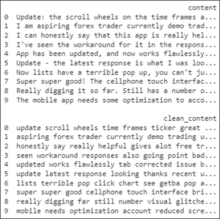

Gambar 4\. 1 Hasil Preprosesing

	Setelah teks dibersihkan, setiap ulasan dikonversi menjadi representasi vektor menggunakan model **Sentence-BERT (all-mpnet-base-v2)**. Model ini menghasilkan embedding berdimensi 768 untuk setiap kalimat dan model ini cocok ketika diterapkan pada tugas seperti klustering yang bersifat semantik. Embedding ini dirancang untuk menangkap makna semantik secara utuh, sehingga kalimat-kalimat yang serupa dalam arti akan memiliki representasi vektor yang berdekatan dalam ruang embedding.

	Output dari tahap ini adalah sebuah matriks dengan ukuran ***N × 768***, di mana N adalah jumlah ulasan yang telah diproses. Representasi ini menjadi dasar bagi proses reduksi dimensi dan klastering selanjutnya. Kemudian untuk mempermudah proses klastering dan visualisasi, embedding dari Sentence-BERT direduksi menggunakan **Principal Component Analysis (PCA)** dengan parameter n\_components=2. Dengan demikian, setiap ulasan direpresentasikan sebagai titik dalam ruang dua dimensi, tanpa kehilangan terlalu banyak informasi penting dari struktur awal. 

	Setelah melakukan tahap reduksi dimensi, disini saya juga menerapkan tahap ***Elbow Method*** untuk menentukan *k* optimal alias banyaknya kluster yang cocok untuk KMeans untuk dataset yang saya gunakan.

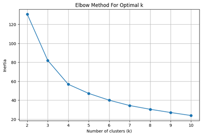

Gambar 4\. 2 Optimal k Dengan Elbow Method

Berdasarkan grafik *Elbow Method* diatas, jumlah kluster yang optimal adalah sebanyak 4 kluster

	Dalam penelitian ini, dua algoritma klastering dengan pendekatan berbeda, yaitu **KMeans** dan **HDBSCAN**, digunakan untuk mengeksplorasi kemampuan dalam mengelompokkan ulasan pengguna aplikasi TradingView. Kedua algoritma tersebut diterapkan pada representasi semantik hasil embedding menggunakan **Sentence-BERT**, dengan tujuan mengevaluasi kualitas klaster yang terbentuk. Penilaian dilakukan menggunakan dua metrik evaluasi utama, yaitu **Silhouette Score** dan **Davies-Bouldin Index (DBI)**, yang umum digunakan dalam analisis unsupervised learning.

Pada penerapan **KMeans**, jumlah klaster ditentukan sebanyak **empat**, berdasarkan hasil eksplorasi awal terhadap distribusi data. Evaluasi menunjukkan bahwa algoritma ini menghasilkan **Silhouette Score sebesar 0.423**, yang mengindikasikan bahwa batas antar klaster belum cukup tegas, serta terdapat kemungkinan tumpang tindih antara titik-titik data dari klaster yang berbeda. Selain itu, nilai **Davies-Bouldin Index sebesar 0.797** menunjukkan bahwa kedekatan antar klaster relatif tinggi, sementara kepadatan internalnya masih dapat ditingkatkan. Meski begitu, KMeans tetap memberikan struktur klaster yang mudah diinterpretasi dan secara geometris terdefinisi dengan baik.

Di sisi lain, **HDBSCAN** menunjukkan performa yang lebih kuat dalam menghadapi distribusi data yang tidak homogen dan mengandung noise. Tidak seperti KMeans yang membutuhkan jumlah klaster di awal, HDBSCAN secara otomatis menyesuaikan pembentukan klaster berdasarkan kepadatan lokal masing-masing data. Setelah parameter disesuaikan, algoritma ini menghasilkan **Silhouette Score sebesar 0.625** dan **Davies-Bouldin Index sebesar 0.444**, yang menandakan bahwa hasil klaster yang terbentuk lebih jelas dan lebih padat dibandingkan dengan KMeans. Kemampuan HDBSCAN dalam mendeteksi data yang tidak sesuai dengan klaster mana pun sebagai **outlier** menjadi nilai tambah dalam mengatasi variasi alami dari teks ulasan yang tidak beraturan.

| Algoritma | Silhouette | Davies-Bouldin |
| ----- | ----- | ----- |
| KMEANS | 0.423 | 0.797 |
| HDBSCAN | 0.625 | 0.444 |

Tabel 4\. 2 Evaluasi Internal Matriks

Hasil evaluasi menunjukkan bahwa model menghasilkan pembagian klaster yang cukup baik, terutama pada KMeans dengan jumlah klaster yang tepat. HDBSCAN juga efektif terutama dalam menangani data yang tidak terstruktur dengan baik. Visualisasi klaster KMeans dapat dilihat pada *Gambar 4.3* dan klaster hasil dari HDBSCAN dapat dilihat pada *Gambar 4.4.*

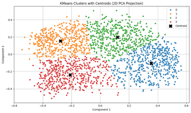

Gambar 4\. 3 Visualisasi Klaster KMeans

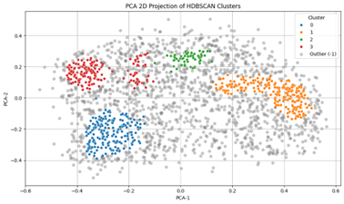

Gambar 4\. 4 Visualisasi Klaster HDBSCAN

	Untuk mengetahui tema dominan dalam setiap klaster, dilakukan visualisasi kata-kata yang paling sering muncul menggunakan **WordCloud** dan sampel ulasan dari masing masing klaster. Contoh 5 ulasan dan top 10 kata dari masing masing-masing kluster KMeans dapat dilihat pada tabel

| \--- KMeans Cluster 0 \--- |
| ----- |
| 1\. aspiring forex trader currently demo trading useful mefrom ui functionality available tools everything well put togetheri able analyze charts mobile phone virtually precision would laptopnow impressive big props developersas someone else revieweda lot work put shows lot |
| 2\. honestly say really helpful gives alot free trading signals indicators want indicators turned though start paying month free access still gives alot worth using pay though get use apply technical indicators copy professional analytics clean ui easy navigate supports dark mode well also accurate lagging market pulse |
| 3\. best charting platform available difficult create drawings using phone due smaller screen large fingers imagine would work really well tablet andor stylus think well done issues syncs seamlessly tradingview accounts via cloud great interface nearly features available desktop browser version highly recommend |
| 4\. fantastic charting functionality truly top notch one feature would like see available browser ability movecopy symbols watchlists also another reviewer mentioned always reflect changes made browser earlier day happen times overall best charting far |
| 5\. used mobile version short time thus far web version best charting software used many tools use data many viewing options thus far mobile version keeps tradition excellent update years later still using enjoying tradingview |
| Top 10 kata: \[('trading', 292), ('best', 173), ('tradingview', 158), ('use', 135), ('charting', 126), ('charts', 122), ('good', 112), ('platform', 111), ('chart', 109), ('great', 108)\] |
| 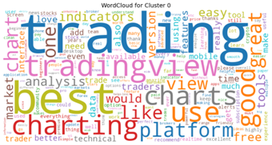 |
| **\--- KMeans Cluster 1 \---** |
| 1\. updated works flawlessly tab corrected issue back stars looking stock chart everything fine tap stock ticker name top left corner choose different ticker look screen rotates portrait even though tablet landscape super wonky seems unfinished rate higher due gets fixed change rating thanks samsung galaxy tab |
| 2\. really digging far still number visual glitches screen zooms either impossibly impossibly close also scrollingzooming viewport indicators move sync sometimes turn indicators fix usually considering scripts built community expected started basic payed version see goes |
| 3\. edit fixed update thank favorite time frames point favorite time frames easy access kind dumb design favorite time frames used top easy access one click click bottom change iphone able scroll bottom switch favorite tf makes sense android ui horrible renew premium year awful design |
| 4\. desktop version fantastic however leave screen open idle seconds freezes hard reset phone happened times basically useless phone forced use laptop defeats purpose negative update new updates problem longer exists everything works great |
| 5\. bring back news watchlist button right side bar previously alarms button desktop version removed news flow located bottom technicals window minimize see watchlist drill keep finding news also keep lightning bolt chart specific news great however move bar right cover current days volume bar make opaquethanks |
| Top 10 kata: \[('update', 185), ('new', 122), ('please', 113), ('version', 100), ('time', 94), ('use', 74), ('back', 70), ('screen', 63), ('fix', 63), ('like', 62)\] |
| 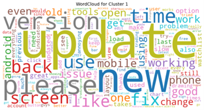 |
| **\--- KMeans Cluster 2 \---** |
| 1\. super super good cellphone touch interface brilliant tons data course indicators easy add charts zooming zooming extremely intuitive fast data easy see cellphone get better trading getting subscription update bought black friday special set alerts alert woke bought bitcoin alert woke back sold less hours made money back |
| 2\. mobile needs optimization account reduced screen size service excellent well worth money tablet course easier use increased screen real estate could use tutorial features gestures navigate example idea find alerts thing |
| 3\. love options tradingview complaint ea option without connecting mt pinescript really problem however learning curve learn platforms well become proficient tradingview well yet still good platform lots options |
| 4\. love used almost everyday last years honestly say major issues feature many name top notched editable customisable slight learning curve easy use get lot relates markets put time effort learn something well |
| 5\. really like upgraded paid plan find worth great job way around wondering integrating stock screener works know open browser phone navigate home get screener etc would nice button regardless great product |
| Top 10 kata: \[('use', 121), ('great', 98), ('good', 96), ('like', 90), ('would', 87), ('trading', 86), ('free', 82), ('version', 76), ('time', 66), ('best', 63)\] |
| 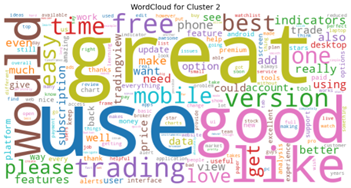 |
| **\--- KMeans Cluster 3 \---** |
| 1\. update scroll wheels time frames ticker great update new ui older ui efficient please bring back option retain time single tap changed require single tap ui failure point changing things sake aesthetics |
| 2\. seen workaround responses also going point bad ux new popup click symbol get full chart latest update pointless please default back going straight chart click symbol otherwise course love tradingview still think unparalleled |
| 3\. update latest response looking thanks recent update click watchlist symbol one month line chart opens click maximize far right get saved layout candles indicators change really annoying response quick overview yahoo finance one uses charting tool stick good please change make setting choice |
| 4\. lists terrible pop click chart see getba pop available chart settings makes feel chunky fluid magnet drawing lines hard fingers way needs way use tools move without fingers way tap hold crosshairs used move around without needing fingers way use show people eyes looking |
| 5\. love gave new chart chance used weeks go back old chart much quicker maneuver timeframes chart types indicators using old chart good attempt though new chart ui looks prettier old annoying click multiple times select feature click top old chart |
| Top 10 kata: \[('chart', 418), ('update', 189), ('charts', 183), ('time', 139), ('please', 127), ('new', 99), ('open', 79), ('fix', 76), ('view', 76), ('version', 76)\] |
| 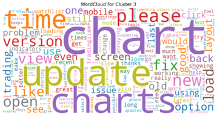 |

Tabel 4\. 3 WordCloud dan Sampel Ulasan Tiap Klaster KMeans

| Cluster | Topik Utama | Konteks Pengguna | Kata Kunci |
| :---: | ----- | ----- | ----- |
| **0** | Pengalaman positif & fitur lengkap | Puas dengan fitur charting, UI, mobile usability. Cocok untuk trader aktif. | trading, best, charting, platform, great |
| **1** | Masalah teknis & permintaan perbaikan | Keluhan bug, UI buruk, permintaan restore fitur lama. | update, fix, please, screen, back |
| **2** | Apresiasi fitur premium & pembelajaran | Pengguna serius, senang dengan fitur berbayar dan proses belajar. | use, great, good, worth, free |
| **3** | Kritik terhadap UI baru & UX | Tidak puas dengan update UI baru, ingin kembali ke tampilan lama yang lebih efisien. | chart, update, please, view, version |

Tabel 4\. 4 Topik Ulasan Tiap Klaster KMeans

| \--- HDBSCAN Cluster 0 \--- |
| ----- |
| 1\. great access charts functional form going mobile browser really needs manual refresh button though recent update makes click multiple times get real chart instead first click goes line chat good tv come simple lines update tv responded quickly told fix back |
| 2\. one point wanted delete drawn lines chart message displayed asking wanted delete locked shapes well good option unfortunately mistakenly selected option ask question deletes locked unlocked drawings together reset option unlocked shapes deleted chart |
| 3\. love trading view however last daysweeks noticed widget throwing error notification every time try update recent prices oops something wrong great great platform |
| 4\. able seamlessly creat ratio charts example gldslv functionality seems completely gone mobile happened please fix elaborate broke update edit problem fixed thanks love |
| 5\. going back switching another charts automatically refresh come latest time stay point left annoying go back chart manually |
| Top 10 kata: \[('chart', 166), ('update', 76), ('charts', 64), ('please', 51), ('time', 48), ('new', 43), ('open', 42), ('version', 35), ('fix', 33), ('layout', 30)\] |
| 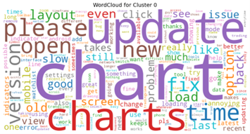 |
| **\--- HDBSCAN Cluster 1 \---** |
| 1\. aspiring forex trader currently demo trading useful mefrom ui functionality available tools everything well put togetheri able analyze charts mobile phone virtually precision would laptopnow impressive big props developersas someone else revieweda lot work put shows lot |
| 2\. honestly say really helpful gives alot free trading signals indicators want indicators turned though start paying month free access still gives alot worth using pay though get use apply technical indicators copy professional analytics clean ui easy navigate supports dark mode well also accurate lagging market pulse |
| 3\. use almost every day easy use clear unambiguous charting builtin indicators community designed scripting interface creating configurable alerts keep top profit strategies real time data markets available top performance requires fairly date hardware everything expect top performance fossil |
| 4\. absolutely priceless application would recommend anyone piece together good strategy makes chart calculations overlay multiple indicators great feature best thing application completely customizable perfectly calculate profitable strategic methods quick cash instantly live chart also customized great application guys keep good work take care |
| 5\. amazing watch market make predictions entering numbers mt much smoother easier read mt charts also ton helpful features utilize thinking upgrading paid version simply alerts free version amazing |
| Top 10 kata: \[('trading', 150), ('use', 68), ('best', 55), ('good', 54), ('free', 53), ('great', 49), ('tradingview', 43), ('platform', 43), ('view', 42), ('like', 40)\] |
| 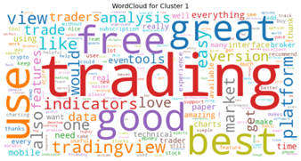 |
| **\--- HDBSCAN Cluster 2 \---** |
| 1\. good would like side bar easy choose favorite tools minimisable create room would recommend |
| 2\. pretty good good scripting executions real time without lag slightly clunky places think gotten better time |
| 3\. love love update need absorb fxreplay include service money people would pay doubt |
| 4\. great easy use suggestion please make easy add pinescript mobile struggling pinescript |
| 5\. awesome almost good desktop version love info palm hand |
| Top 10 kata: \[('like', 15), ('time', 14), ('good', 13), ('great', 12), ('use', 10), ('make', 9), ('would', 8), ('love', 8), ('version', 8), ('alert', 8)\] |
| 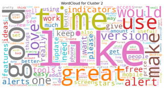 |
| **\--- HDBSCAN Cluster 3 \---** |
| 1\. really digging far still number visual glitches screen zooms either impossibly impossibly close also scrollingzooming viewport indicators move sync sometimes turn indicators fix usually considering scripts built community expected started basic payed version see goes |
| 2\. edit fixed update thank favorite time frames point favorite time frames easy access kind dumb design favorite time frames used top easy access one click click bottom change iphone able scroll bottom switch favorite tf makes sense android ui horrible renew premium year awful design |
| 3\. one thing would really like see ability set favorites bar vertical horizontal otherwise great |
| 4\. sofar good pls consider add zoom pinescript small edit script without glasses |
| 5\. panel v historic alerts sended account thanks assistance found |
| Top 10 kata: \[('update', 64), ('new', 41), ('please', 38), ('version', 32), ('time', 31), ('screen', 29), ('back', 28), ('working', 26), ('open', 24), ('fix', 23)\] |
| 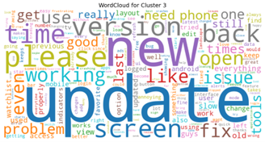 |

Tabel 4\. 5 WordCloud dan Sampel Ulasan Tiap Klaster HDBSCAN

| Cluster | Topik Utama | Konteks Pengguna | Kata Kunci |
| :---: | ----- | ----- | ----- |
| 0 | Masalah pada chart & pembaruan fitur | Pengguna mengeluh soal chart tidak sinkron, refresh manual, dan update yang merusak fitur penting seperti rasio chart, layout, dan auto-refresh. | chart, update, please, fix, layout, time |
| 1 | Pengalaman sangat positif & fitur lengkap | Ulasan penuh pujian terhadap kualitas aplikasi, kemudahan penggunaan, dan fitur indikator, sinyal, serta performa aplikasi. Banyak menyebut TradingView sebagai platform terbaik. | update, fix, please, screen, back |
| 2 | Pujian ringan dengan saran fitur tambahan | Ulasan positif namun singkat, berisi saran fitur baru seperti sidebar, zoom, atau pinescript di mobile. Tidak ada keluhan besar, tapi bersifat konstruktif. | use, great, good, worth, free |
| 3 | Kritik terhadap desain & UX baru | Keluhan pada UI yang membingungkan, bug tampilan, dan desain favorit time frame yang tidak efisien. Beberapa pengguna ingin perbaikan UX untuk kenyamanan. | chart, update, please, view, version |

Tabel 4\. 6 Topik Ulasan Tiap Klaster HDBSCAN

5. # **Kesimpulan**

	Penelitian ini bertujuan untuk mengelompokkan ulasan pengguna aplikasi TradingView menggunakan pendekatan unsupervised learning berbasis representasi semantik dari Sentence-BERT. Melalui tahapan preprocessing, embedding, reduksi dimensi dengan PCA, serta klastering menggunakan KMeans dan HDBSCAN, diperoleh hasil yang menunjukkan bahwa data ulasan dapat diklasifikasikan ke dalam beberapa kelompok topik yang bermakna.

	Model **Sentence-BERT all-mpnet-base-v2** terbukti efektif dalam menangkap makna kalimat dan menghasilkan embedding berdimensi 768 yang dapat digunakan untuk analisis lanjutan. Proses **reduksi dimensi dengan PCA ke dalam 2 dimensi** mempermudah visualisasi serta mendukung proses klastering secara efisien.

	Dalam hal performa klastering, algoritma **HDBSCAN** menunjukkan hasil yang lebih baik dibandingkan **KMeans**, dengan **Silhouette Score sebesar 0.625** dan **Davies-Bouldin Index sebesar 0.444**, mengungguli KMeans yang hanya mencapai **Silhouette Score 0.423** dan **DBI sebesar 0.797**. HDBSCAN juga memiliki keunggulan dalam mengidentifikasi outlier dan beradaptasi dengan struktur data yang tidak seragam.

	Secara keseluruhan, kombinasi teknik modern NLP dan klastering density-based berhasil mengungkap pola topik dalam ulasan pengguna tanpa supervisi, yang dapat dimanfaatkan lebih lanjut sebagai insight untuk pengembangan produk dan strategi peningkatan pengalaman pengguna.

